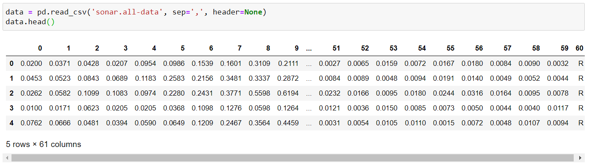
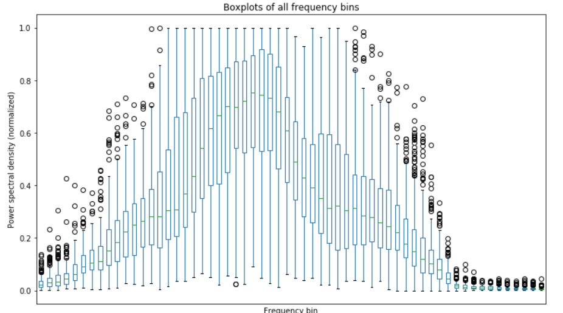
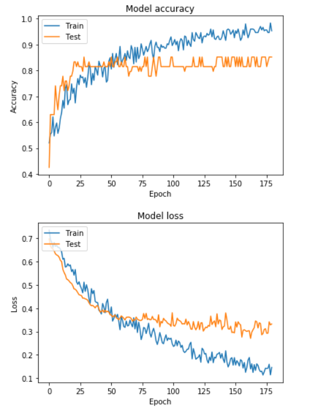

# KerasNN_Classification

A simple case study to implementing the Keras Neural Network, the structure and verification process.

# Dataset: 
Origional dataset from  UCI: http://archive.ics.uci.edu/ml/datasets/Connectionist+Bench+%28Sonar%2C+Mines+vs.+Rocks%29

Each pattern is a set of 60 numbers in the range 0.0 to 1.0. Each number represents the energy within a particular frequency band, integrated over a certain period of time. 
The label associated with each record contains the letter "R" if the object is a rock and "M" if it is a mine (metal cylinder). 



A boxplot to have a brief understanding of those 60 features



# Neural Network implementation

```Jupyter
# Create model
model = Sequential()
model.add(Dense(64, activation='relu', input_dim=len(X[0])))
model.add(Dropout(0.4))
model.add(Dense(4, activation='relu'))
model.add(Dropout(0.1))
model.add(Dense(2, activation='sigmoid'))
model.summary()
```

Check the loss and accuracy



The training set can achieve verification accuracy of 85.1% and Test set is 87.5%
